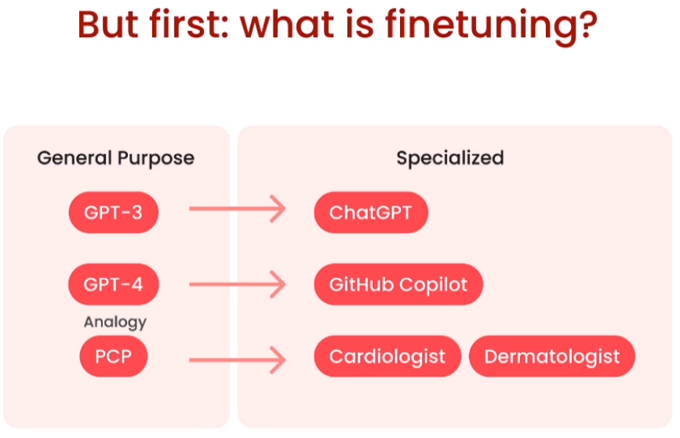
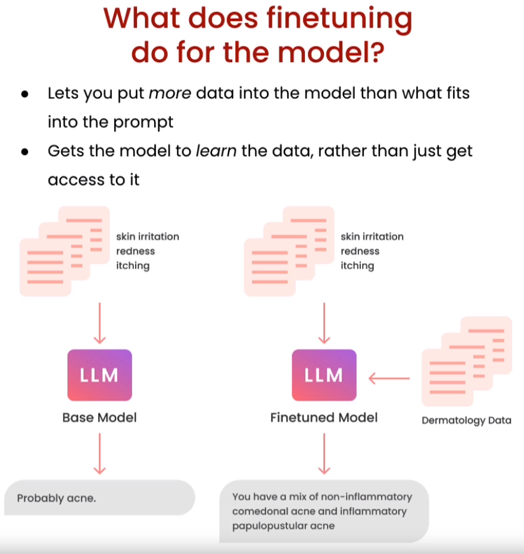
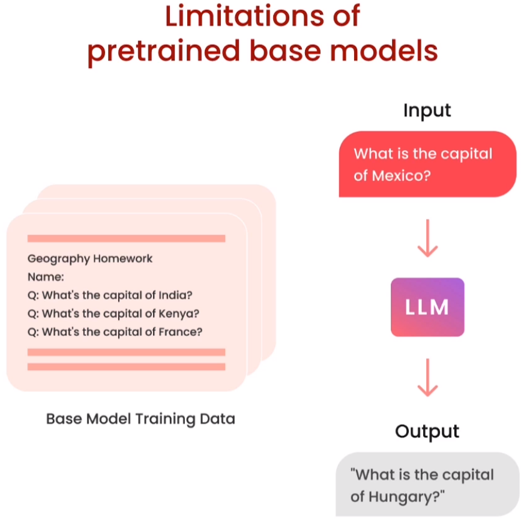
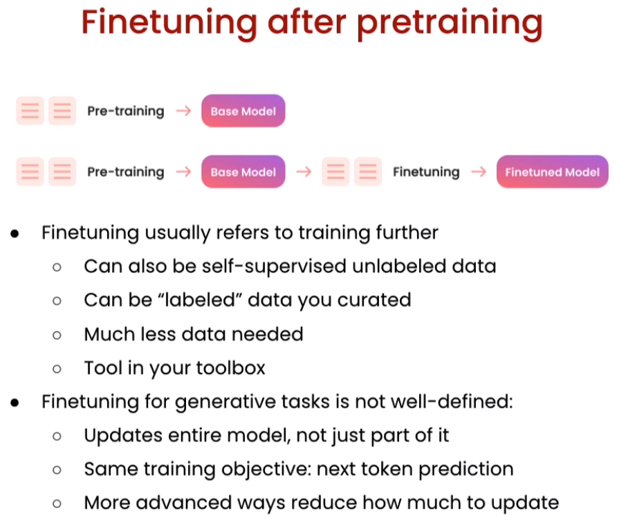
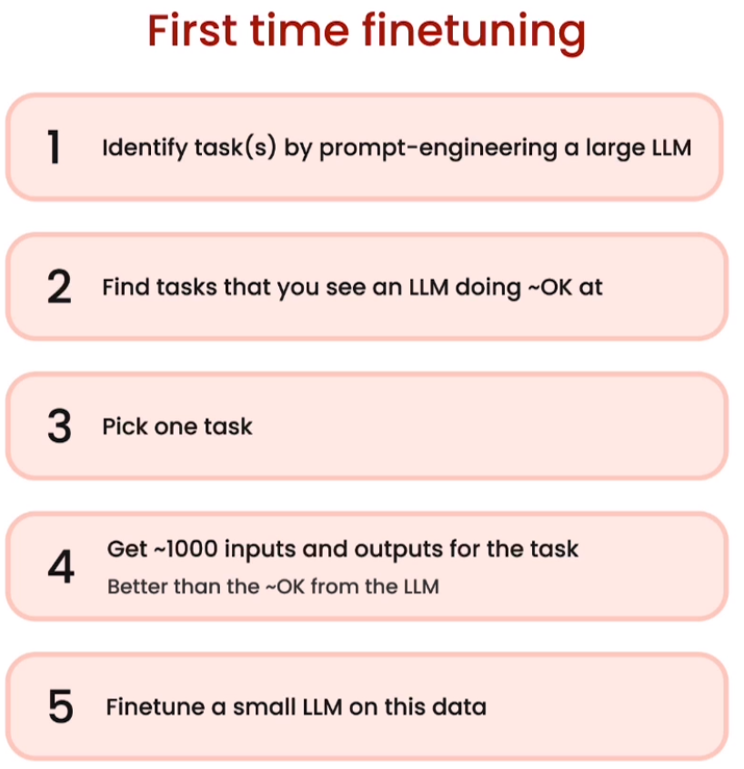
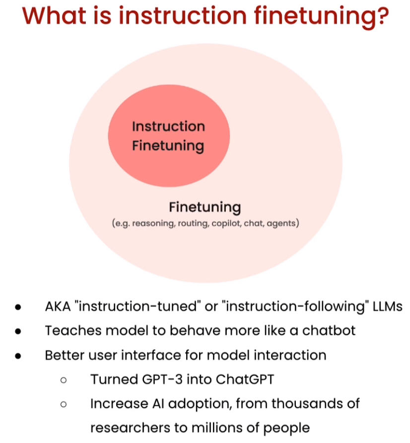
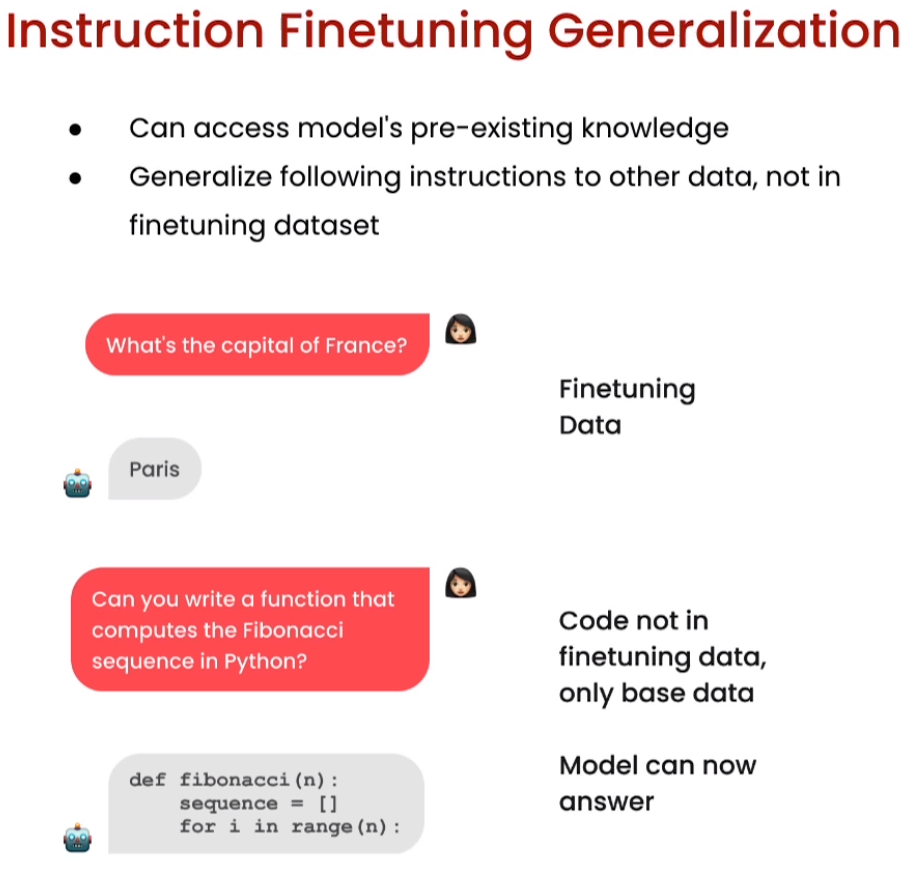
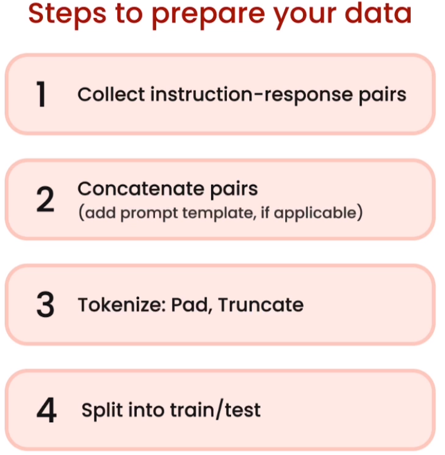

# 🚀 [Finetuning Large Language Models](https://www.deeplearning.ai/short-courses/finetuning-large-language-models/)

📚 Welcome to the "Finetuning Large Language Models" course! Join our instructor, Sharon Zhou, Co-Founder and CEO of Lamini, and an expert in the field. Learn the ins and outs of finetuning Large Language Models (LLMs) to supercharge your NLP projects.

## Course Summary
📖 This short course will equip you with the essential knowledge and skills to harness the power of finetuning in Large Language Models. Whether you are looking to fine-tune models for specific tasks or domains, this course covers it all.

You'll learn:

1. 🎯 **Why Finetuning**:

 
 

2. 🎯 **Where Finetuning fits in**: Gain insights into when and why you should apply finetuning to LLMs for optimal results.

 
 
 

3. **Instruction tuning**:

 
 

4. 📦 **Data Preparation**: Learn how to prepare your data effectively to get the most out of your finetuning process.

 
 

6. 🧠 **Training and Evaluation**: Discover how to train and evaluate an LLM on your data to achieve superior performance.

By finetuning, you have the ability to adapt the model to your specific needs, update neural net weights, and improve the model's performance beyond traditional methods.

## Key Takeaways
- 🧭 Understand the strategic use of finetuning in Large Language Models.
- 📊 Master the art of data preparation for successful model adaptation.
- 🚀 Train and evaluate LLMs to achieve impressive results.

## About the Instructor
🌟**Sharon Zhou** is the Co-Founder and CEO of Lamini. With a wealth of experience in NLP and AI, Sharon is a renowned expert in the field.

🔗 Reference: "Finetuning Large Language Models" course. To enroll in the course or for further information, visit [deeplearning.ai](https://www.deeplearning.ai).
