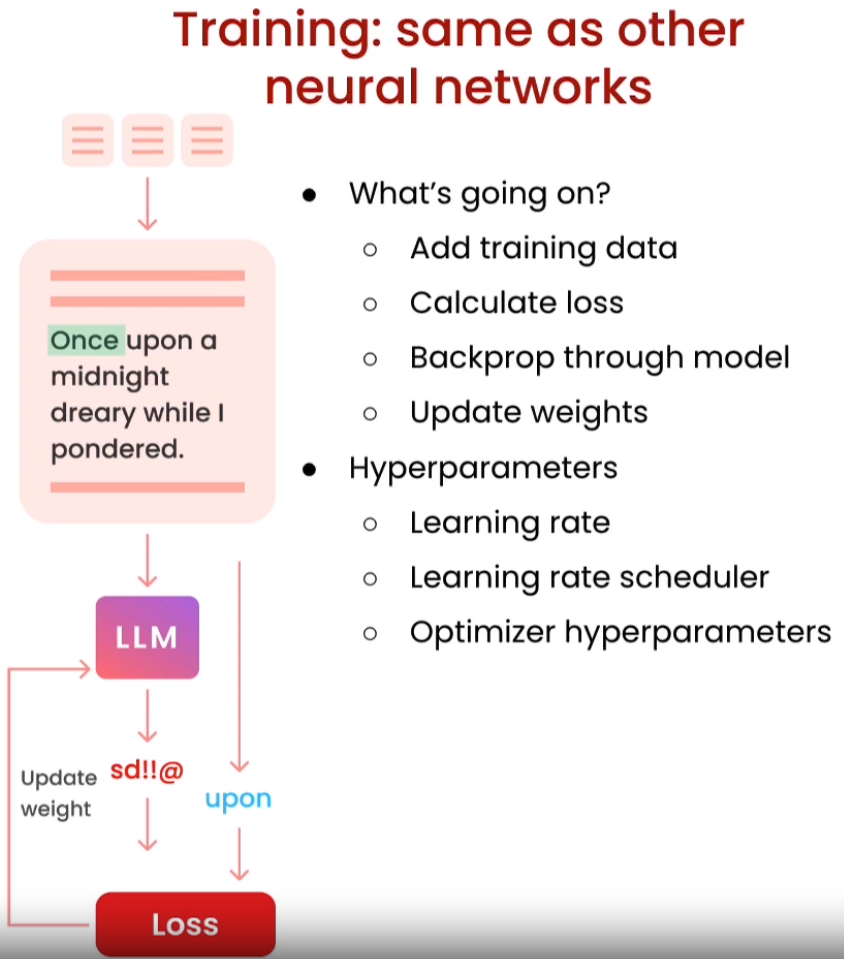

# 🚀 [Finetuning Large Language Models](https://www.deeplearning.ai/short-courses/finetuning-large-language-models/)

📚 Welcome to the "Finetuning Large Language Models" course! Learn the ins and outs of finetuning Large Language Models (LLMs) to supercharge your NLP projects.

## Course Summary
📖 This short course will equip you with the essential knowledge and skills to harness the power of finetuning in Large Language Models. Whether you are looking to fine-tune models for specific tasks or domains, this course covers it all.

You'll learn:

1. 🔍 **Why Finetuning**: By finetuning, you have the ability to adapt the model to your specific needs, update neural net weights, and improve the model's performance beyond traditional methods.

 
 

2. 🏗️ **Where Finetuning fits in**: Gain insights into when and why you should apply finetuning to LLMs for optimal results.

 
 
 

3.  🧩 **Instruction tuning**: Explore the art of optimizing your model's guidance for specific tasks, ensuring the most efficient and effective use of fine-tuned language models.

 
 

4. 📦 **Data Preparation**: Learn how to prepare your data effectively to get the most out of your finetuning process.

 
 

5. 🧠 **Training and Evaluation**: Discover how to train and evaluate an LLM on your data to achieve superior performance.

 
 

## Key Takeaways
- 🧭 Understand the strategic use of finetuning in Large Language Models.
- 📊 Master the art of data preparation for successful model adaptation.
- 🚀 Train and evaluate LLMs to achieve impressive results.

## About the Instructor
🌟**Sharon Zhou** is the Co-Founder and CEO of Lamini. With a wealth of experience in NLP and AI, Sharon is a renowned expert in the field.

🔗 Reference: "Finetuning Large Language Models" course. To enroll in the course or for further information, visit [deeplearning.ai](https://www.deeplearning.ai).
